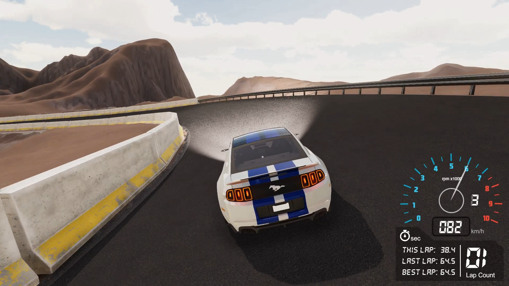

# AutoRACE Simulator
### A Simulation System for Implementing and Testing Autonomous Racing Algorithms



## SETUP

1. Install Unity Hub along with Unity 2018.4.24f1 (LTS) or higher.

2. Install Python 3.6.1 or higher (Anaconda installation is preferred as we'll be creating a virtual environment shortly).

3. Install ML-Agents Unity Package by cloning the latest stable release of [Unity ML-Agents Toolkit](https://github.com/Unity-Technologies/ml-agents):
   
    ```bash
    $ git clone --branch release_6 https://github.com/Unity-Technologies/ml-agents.git
    ```
   
    ***Note:*** *For details regarding installation of Unity ML-Agents, please consult the [official installation guide](https://github.com/Unity-Technologies/ml-agents/blob/master/docs/Installation.md).*

4. Install ML-Agents Python Package (tested version: `mlagents 0.19.0`):

  - Create a virtual environment (strongly recommended):
	    
    ```bash
    $ conda create --name ML-Agents python=3.7
    ```
      
  - Activate the environment:
  
    ```bash
    $ conda activate ML-Agents
    ```

  - Install `mlagents` package from PyPi (this command also installs the required dependencies):
    
    ```bash
    $ pip3 install mlagents
    ```

5. Setup the AutoRACE Simulator:

  - Navigate to the Unity ML-Agents Repository directory:
  
    ```bash
    $ cd <path/to/unity-ml-agents/repository>
    ```
  
  - Clone this repository:
  
    ```bash
    $ git clone https://github.com/Tinker-Twins/AutoRACE_Simulator.git
    ```

  - Launch Unity Hub and select `ADD` project button.
  
  - Navigate to the Unity ML-Agents Repository directory and select the parent folder of this repository `AutoRACE_Simulator`.

## USAGE

### Programming

Every `agent` needs a script inherited from the `Agent` class. Following are some of the useful methods:

1. `public override void Initialize()`

	Initializes the environment. Similar to `void Start()`.

2. `public override void CollectObservations(VectorSensor sensor)`

	Collects observations. Use `sensor.AddObservation(xyz)` to add observation "xyz".

3. `public override void OnActionReceived(float[] vectorAction)`

	Define the actions to be performed using the passed `vectorAction`. Reward function is also defined here. You can use `if`-`else` cases to define rewards/penalties. Don't forget to call `EndEpisode()` to indicate end of episode.

4. `public override void OnEpisodeBegin()`

	This is called when `EndEpisode()` is called. Define your "reset" algorithm here before starting the next episode.

5. `public override void Heuristic(float[] actionsOut)`

	Use `actionsOut[i]` to define manual controls during `Heuristic Only` behaviour.

Attach this script to the agent along with `BehaviourParameters` and `DecisionRequester` scripts inbuilt with the ML-Agents Unity Package (just search their names in `Add Component` dropdown menu of the agent gameobject).

### Debugging

After defining your logic, test the functionality by selecting `Heuristic Only` in the `Behaviour Type` of the `BehaviourParameters` attached to the agent.

### Training

1. Create a configuration file (`<config>.yaml`) to define training parameters. For details, refer the [official training configuration guide](https://github.com/Unity-Technologies/ml-agents/blob/master/docs/Training-Configuration-File.md).

    ***Note:*** *A sample configuration file is provided: `Racer.yaml` for training the agent using a hybrid imitation-reinforcement learning architecture.*

2. Within the `BehaviourParameters` script attached to the agent, give a unique `Behaviour Name` for training purpose.

3. Activate the `ML-Agents` environment:
  
    ```bash
    $ conda activate ML-Agents
    ```

4. Navigate to the Unity ML-Agents Repository directory:
   
   ```bash
    $ cd <path/to/unity-ml-agents/repository>
    ```

5. Start the training.
   
   ```bash
   $ mlagents-learn <path/to/config>.yaml --run-id=<Run1>
   ```

6. Hit the `Play` button in Unity Editor to "actually" start the training.

### Training Analysis

1. Navigate to the Unity ML-Agents Repository directory:
   
   ```bash
    $ cd <path/to/unity-ml-agents/repository>
    ```

2. Launch TensorBoard to analyze the training results:
   
   ```
   $ tensorboard --logdir results
   ```

3. Open browser application (tested with Google Chrome) and log on to http://localhost:6006 to view the training results.

### Deployment

1. Navigate to the Unity ML-Agents Repository directory and locate a folder called `results`.

2. Open the `results` folder and locate a folder named after the `<training_behaviour_name>` that you used while training the agent(s).

3. Copy the saved neural network model(s) (with `.nn` extension) into the `NN Models` folder of the `AutoRACE Simulator` Unity Project.

4. In the inspector window, attach respective NN model(s) to the `Model` variable in the `BehaviourParameters` script attached to the agent(s).

5. Select `Inference Only` in the `Behaviour Type` of the `BehaviourParameters` attached to the agent(s).

6. Hit the play button in Unity Editor and watch your agent(s) play!

## IMPORTANT TIPS

1. Craft the reward function carefully; agents cheat a lot!

2. Tune the training parameters in `<config>`.yaml file.

3. As long as possible, duplicate the training arenas within the scene to ensure parallel (faster) training.

    ***Note:*** *Make sure to commit changes (if any) to all the duplicates as well!*

## DEMO
Implementation demonstrations are available on [YouTube](https://www.youtube.com/playlist?list=PLY45pkzWzH98HT0U8xq2j9OjybFDIaFN0).
